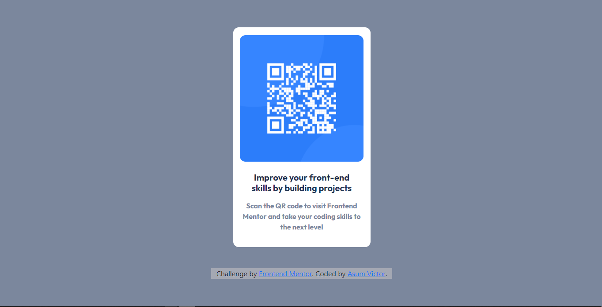

# Frontend Mentor - QR code component solution

This is a solution to the [QR code component challenge on Frontend Mentor](https://www.frontendmentor.io/challenges/qr-code-component-iux_sIO_H). Frontend Mentor challenges help you improve your coding skills by building realistic projects. 

## Table of contents

- [Overview](#overview)
  - [Screenshot](#screenshot)
  - [Links](#links)
- [My process](#my-process)
  - [Built with](#built-with)
- [Author](#author)

## Overview

### Screenshot

**FOR DESKTOP**

**FOR MOBILE**

### Links

- Solution URL: [Click here](https://github.com/AsumVictor/frontendMentor-QR-code-component)
- Live Site URL: [View website](https://asumvictor.github.io/frontendMentor-QR-code-component/)

## My process

### Built with
-[x] Code Editor
    - VS code

-[x] Languages  
   - [ ] Semantic HTML5 markup
   - [ ] CSS custom properties
       - Flexbox

  - [x] Frameworks  
     - Bootstrap

## Author

- Frontend Mentor - [@yourusername](https://www.frontendmentor.io/profile/AsumVictor)
- Twitter - [@iamasum369](https://www.twitter.com/iamasum369)

